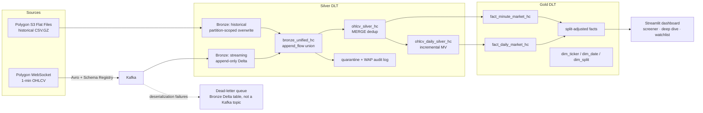

# Market Data Streaming & Analytics Platform

A streaming lakehouse on Databricks that ingests live 1-minute OHLCV bars for US equities from Polygon.io through Kafka (Avro), lands them in a medallion architecture (Bronze → Silver → Gold, Delta Live Tables), and serves a Streamlit analytics dashboard. The three hardest problems it solves: **(1)** Kafka delivers at-least-once, and the same bar can also arrive again via historical flat files — Silver deduplicates everything with a MERGE on `(symbol, start_timestamp)`; **(2)** data quality is auditable, not silent — invalid rows are quarantined with a rejection reason instead of dropped, and a daily quality gate halts the pipeline if rejection rates spike; **(3)** two independent sources (real-time stream + historical S3 flat files) are unified into one consistent table with deterministic source-priority conflict resolution.

## Architecture



📸 See it running: [pipeline DAGs, quality audit, and dashboard screenshots](docs/screenshots/README.md).

A parallel news pipeline (Polygon news API → Bronze → [news_silver_dlt.py](databricks/silver/news_silver_dlt.py) → `fact_news_hc`) feeds ticker-level news into the same star schema.

## Engineering decisions

- **MERGE-based dedup with source priority, not `dropDuplicates()`.** Silver upserts on `(symbol, start_timestamp)` via DLT `apply_changes`, sequenced by `(source_priority, ingestion_timestamp, payload_hash)` — so a historical flat-file bar deterministically beats the delayed streaming bar for the same minute, retries never create duplicate rows, and there is no streaming state store to manage. ([ohlcv_silver_dlt.py:432](databricks/silver/ohlcv_silver_dlt.py#L432), [ohlcv_dedup_spark.py:36](databricks/utils/ohlcv_dedup_spark.py#L36))

- **Write-Audit-Publish quarantine instead of `expect_or_drop`.** Rows that fail validation (non-positive prices, broken OHLC relationships, negative volume) land in `ohlcv_silver_quarantine_hc` with a `rejection_reason`, so every rejection is queryable. A daily audit table enforces a hard quality gate: if the rejection rate breaches the critical threshold, the pipeline halts — with a 2-day grace window so late-arriving history can't retroactively fail a run. ([ohlcv_silver_dlt.py:449](databricks/silver/ohlcv_silver_dlt.py#L449), [ohlcv_silver_dlt.py:545](databricks/silver/ohlcv_silver_dlt.py#L545))

- **Idempotent historical backfill via scoped partition overwrite.** The backfill job requires explicit `start_date`/`end_date` parameters (validated, job exits if missing) and uses dynamic partition overwrite to replace only those date partitions — re-running the same range converges to the same state and never touches other dates. ([historical_ingestion_flatfiles.py](databricks/bronze/historical_ingestion_flatfiles.py))

- **Daily rollup as an incrementally refreshed materialized view.** Gold reads ~2.9M pre-aggregated daily rows instead of scanning ~420M minute rows. The rollup is a pure, time-independent `groupBy` on `(symbol, date)`, which lets the serverless engine (Enzyme) recompute only changed groups. ([ohlcv_silver_dlt.py:624](databricks/silver/ohlcv_silver_dlt.py#L624), rationale in [docs/DAILY_ROLLUP_DESIGN.md](docs/DAILY_ROLLUP_DESIGN.md))

- **Market-hours lifecycle with drain mode.** The producer and consumer auto-start at 9:30 AM ET and stop at session close + 20 min; at shutdown the consumer drains the Kafka backlog (`processAllAvailable()` with timeout) before stopping. Anything left undrained is safe — Kafka replays it next session and Silver's MERGE absorbs the duplicates. ([streaming_ingestion.py](databricks/bronze/streaming_ingestion.py))

- **Real-world market edge cases handled in code.** NYSE early-close days (July 3, Christmas Eve) use the actual session close from an exchange calendar instead of a static 4:00 PM cutoff ([ohlcv_silver_dlt.py:174](databricks/silver/ohlcv_silver_dlt.py#L174)); split-adjusted fact tables sit beside raw prices so a 10:1 split day doesn't read as a −90% return ([dim_split_dlt.py](databricks/gold/dim_split_dlt.py)); Avro poison messages route to a dead-letter table (a Bronze Delta table, not a Kafka topic) instead of killing the stream.

## Data model (Gold star schema)

| Table | Grain (one row per) | Key |
|---|---|---|
| `fact_minute_market_hc` | symbol × minute bar | (symbol, start_timestamp) |
| `fact_daily_market_hc` | symbol × trading day | (symbol, date) |
| `fact_minute_market_adjusted_hc` | symbol × minute, split-adjusted columns beside raw | (symbol, start_timestamp) |
| `fact_daily_market_adjusted_hc` | symbol × day, split-adjusted columns beside raw | (symbol, date) |
| `fact_news_hc` | article × ticker pair | (article_id, symbol) |
| `dim_ticker_hc` | ticker (SCD Type 1) | symbol |
| `dim_date_hc` | calendar date, 2020 → current+5y | date |
| `dim_split_hc` | split event | (symbol, execution_date) |

Full column-level reference: [docs/DATA_DICTIONARY.md](docs/DATA_DICTIONARY.md) · lineage: [docs/DATA_LINEAGE.md](docs/DATA_LINEAGE.md) · ERDs: [Bronze](docs/BRONZE_LAYER_ERD.md) / [Silver](docs/SILVER_LAYER_ERD.md) / [Gold](docs/GOLD_LAYER_ERD.md)

## Quality & testing

Three layers of defense, by failure severity ([docs/DATA_QUALITY_ENFORCEMENT.md](docs/DATA_QUALITY_ENFORCEMENT.md)):

1. **Schema contract** — `expect_or_fail` halts the pipeline on impossible rows (null keys, inverted timestamps, wrong timestamp unit).
2. **Row-level WAP quarantine** — business-rule failures are diverted with a rejection reason, never silently dropped.
3. **Aggregate gate** — a daily audit log computes the rejection rate and fails the run past a critical threshold, plus a warn-only session-completeness check.

The pytest suite (44 tests) includes real-SparkSession integration tests covering the dedup tiebreaker, quarantine reason precedence, quality-gate thresholds, and minute-to-daily aggregation ([tests/test_integration_spark.py](tests/test_integration_spark.py)). CI gates every push: `ruff check`, `ruff format --check`, `pytest --cov`, and Avro schema validation ([.github/workflows/ci.yml](.github/workflows/ci.yml)).

Schema evolution is contract-first: [schemas/avro/ohlcv_aggregate.avsc](schemas/avro/ohlcv_aggregate.avsc) is the single source of truth, new fields must be nullable with defaults, and the Schema Registry validates every message before it reaches Kafka.

## Running it

```bash
pip install -r requirements.txt
pytest                  # run tests (Spark integration tests need Java 11)
ruff check . && ruff format .
python scripts/add_secrets_rest_api.py   # push secrets to Databricks
```

All storage uses Unity Catalog Volumes (`/Volumes/tabular/dataexpert/hc_market_data/`) — no cloud credentials in code. Credentials live in the Databricks secret scope `ganhockchong-market-data` (Polygon API key, Kafka SASL, Schema Registry, flat-file access keys); code references keys by name only. Each streaming query gets an isolated checkpoint path under `_checkpoints/<layer>/<pipeline_name>` ([base_config.py](databricks/config/base_config.py)).

Deep-dive documentation, including analyst-style business questions answerable from the star schema, lives in [docs/](docs/README.md).

## Limitations & what I'd do next

- **The feed is delayed, not true real-time.** The platform uses Polygon's delayed WebSocket feed; the architecture wouldn't change for the real-time feed, but latency claims are bounded by the source.
- **Quarantine and audit cover a rolling 30-day window**, not all history — a deliberate trade-off to keep per-run scan cost constant. Older rejections age out of the audit tables.
- **Single environment, no staging.** A next step would be a dev/prod split with Databricks Asset Bundles and table-level permissions, plus alerting on the WAP audit gate instead of relying on pipeline failure.

## Capstone Criteria — Submission Map

How this project satisfies each capstone review criterion, with links to the evidence.

### Criteria 1: Project Spec

- **Schemas** — The Avro contract for the streaming source is the single source of truth: [schemas/avro/ohlcv_aggregate.avsc](schemas/avro/ohlcv_aggregate.avsc). Column-level schemas for every Bronze/Silver/Gold table are documented in [docs/DATA_DICTIONARY.md](docs/DATA_DICTIONARY.md), and each DLT table declares an explicit schema in code (e.g. [ohlcv_silver_dlt.py](databricks/silver/ohlcv_silver_dlt.py)).
- **DAG and data model diagrams** — The end-to-end pipeline DAG is the Mermaid diagram in [Architecture](#architecture) above; table-level lineage is in [docs/DATA_LINEAGE.md](docs/DATA_LINEAGE.md). The data model is the Gold star schema documented in [Data model](#data-model-gold-star-schema) with ERDs per layer: [Bronze](docs/BRONZE_LAYER_ERD.md) / [Silver](docs/SILVER_LAYER_ERD.md) / [Gold](docs/GOLD_LAYER_ERD.md).
- **Metrics and data quality checks** — The WAP audit table tracks rejection rate per day and per rule, with warn/critical thresholds and a session-completeness metric; the full enforcement model is in [docs/DATA_QUALITY_ENFORCEMENT.md](docs/DATA_QUALITY_ENFORCEMENT.md), and example quarantine analysis queries are in [docs/QUARANTINE_QUERIES.md](docs/QUARANTINE_QUERIES.md).
- **Screenshots** — DLT pipeline runs, the WAP quality audit table, and the Streamlit dashboard (screener, ticker deep dive, watchlist) are captured in `docs/screenshots/`.

### Criteria 2: Write Up

- **Purpose and expected outputs** — Covered in the [project summary](#market-data-streaming--analytics-platform) at the top of this README: a streaming lakehouse that turns live and historical Polygon market data into an analytics-ready star schema and a Streamlit dashboard. The original scoping document is [docs/capstone_proposal.md](docs/capstone_proposal.md).
- **Dataset and technology choices, with justifications** — Polygon.io 1-min OHLCV bars (live WebSocket + historical S3 flat files) and the Polygon news API; Kafka with Avro/Schema Registry for transport; Databricks Delta Live Tables for the medallion pipeline. Each non-obvious design choice is justified in [Engineering decisions](#engineering-decisions).
- **Steps followed and challenges faced** — The three hardest problems (at-least-once duplicates across two sources, auditable data quality, deterministic source unification) and how they were solved are described in the summary and [Engineering decisions](#engineering-decisions); real-world edge cases (early-close trading days, stock splits, Avro poison messages) are called out there too.
- **Possible future enhancements** — [Limitations & what I'd do next](#limitations--what-id-do-next).

### Criteria 3: Data Quality Checks

At least 2 checks per data source, enforced in DLT (hard-fail expectations + WAP quarantine):

| Source | Checks |
|---|---|
| Polygon WebSocket stream (via Kafka) | Schema Registry validation on produce; dead-letter Delta table (`bronze/streaming_quarantine`, not a Kafka topic) for poison messages; `expect_or_fail` on timestamps (`start < end`, `start > 0`, ms unit) at [ohlcv_silver_dlt.py:346](databricks/silver/ohlcv_silver_dlt.py#L346); WAP rules `valid_price_positive`, `valid_ohlc_logic`, `valid_volume` ([silver_config.py:104](databricks/config/silver_config.py#L104)) |
| Polygon historical flat files | Same unified Silver path, so identical timestamp expectations + the 3 WAP price/OHLC/volume rules apply; plus required, validated `start_date`/`end_date` parameters before any write ([historical_ingestion_flatfiles.py](databricks/bronze/historical_ingestion_flatfiles.py)) |
| Polygon news API | `expect_or_fail` on `article_id` and `published_utc` ([news_silver_dlt.py:141](databricks/silver/news_silver_dlt.py#L141)); WAP quarantine rules `valid_title`, `valid_url`, `valid_timestamp_order` ([silver_config.py:66](databricks/config/silver_config.py#L66)) |

On top of the row-level checks, a daily aggregate gate computes the rejection rate and halts the pipeline past a critical threshold ([ohlcv_silver_dlt.py:545](databricks/silver/ohlcv_silver_dlt.py#L545)).

### Criteria 4: ETL Code

- **Linted (PEP8)** — `ruff check` and `ruff format --check` run as separate CI gates on every push ([.github/workflows/ci.yml](.github/workflows/ci.yml)).
- **Error-free** — 44 pytest tests including real-SparkSession integration tests, plus Avro schema validation, all gating CI; DLT `expect_or_fail` expectations keep runtime failures loud rather than silent.
- **Tooling** — This project uses the Databricks lakehouse equivalents of the suggested stack: Delta Lake + Spark SQL on Unity Catalog in place of Snowflake/Trino as the warehouse and query engine, Delta Live Tables pipelines + scheduled Databricks Jobs in place of Airflow for orchestration, and a Streamlit/Plotly dashboard in place of Tableau for visualization.
