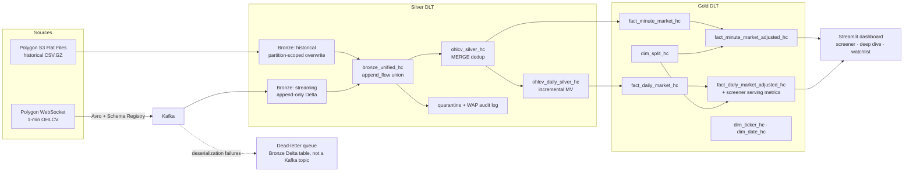

# Market Data Streaming & Analytics Platform

**A production-grade streaming data pipeline that turns live US stock-market data into an analytics dashboard** — ingesting 1-minute price bars for US stock tickers from Polygon.io, processing them through a Databricks lakehouse, and serving them as a queryable star schema (~420M minute-level rows rolled up to ~2.9M daily rows).

`Python` · `SQL` · `Apache Spark` · `Apache Kafka` · `Delta Lake` · `Databricks (Delta Live Tables)` · `AWS S3` · `Avro / Schema Registry` · `Streamlit` · `CI/CD (GitHub Actions)` · `pytest` · `dimensional modeling`

---

### How it works

A streaming lakehouse on Databricks that ingests live 1-minute OHLCV bars for US equities from Polygon.io through Kafka (Avro), lands them in a medallion architecture (Bronze → Silver → Gold, Delta Live Tables), and serves a Streamlit analytics dashboard. The three hardest problems it solves: **(1)** Kafka delivers at-least-once, and the same bar can also arrive again via historical flat files — Silver deduplicates everything with a MERGE on `(symbol, start_timestamp)`; **(2)** data quality is auditable, not silent — invalid rows are quarantined with a rejection reason instead of dropped, and a daily quality gate halts the pipeline if rejection rates spike; **(3)** two independent sources (real-time stream + historical S3 flat files) are unified into one consistent table with deterministic source-priority conflict resolution.

## Architecture



📸 See it running: [pipeline DAGs, quality audit, and dashboard screenshots](docs/screenshots/README.md).

🏗️ Design rationale — layer roles, technology choices, and the schema-contract model: [docs/ARCHITECTURE.md](docs/ARCHITECTURE.md).

A parallel news pipeline (Polygon news API → Bronze → [news_silver_dlt.py](databricks/silver/news_silver_dlt.py) → `fact_news_hc`) feeds ticker-level news into the same star schema.

## Engineering decisions

- **MERGE-based dedup with source priority, not `dropDuplicates()`.** Silver upserts on `(symbol, start_timestamp)` via DLT `apply_changes`, sequenced by `(source_priority, ingestion_timestamp, payload_hash)` — so a historical flat-file bar deterministically beats the delayed streaming bar for the same minute, retries never create duplicate rows, and there is no streaming state store to manage. ([ohlcv_silver_dlt.py:432](databricks/silver/ohlcv_silver_dlt.py#L432), [ohlcv_dedup_spark.py:36](databricks/utils/ohlcv_dedup_spark.py#L36))

- **Write-Audit-Publish quarantine instead of `expect_or_drop`.** Rows that fail validation (non-positive prices, broken OHLC relationships, negative volume) land in `ohlcv_silver_quarantine_hc` with a `rejection_reason`, so every rejection is queryable. A daily audit table enforces a hard quality gate: if the rejection rate breaches the critical threshold, the pipeline halts — with a 2-day grace window so late-arriving history can't retroactively fail a run. ([ohlcv_silver_dlt.py:449](databricks/silver/ohlcv_silver_dlt.py#L449), [ohlcv_silver_dlt.py:545](databricks/silver/ohlcv_silver_dlt.py#L545))

- **Idempotent historical backfill via scoped partition overwrite.** The backfill job requires explicit `start_date`/`end_date` parameters (validated, job exits if missing) and uses dynamic partition overwrite to replace only those date partitions — re-running the same range converges to the same state and never touches other dates. ([historical_ingestion_flatfiles.py](databricks/bronze/historical_ingestion_flatfiles.py))

- **Daily rollup as an incrementally refreshed materialized view.** Gold reads ~2.9M pre-aggregated daily rows instead of scanning ~420M minute rows. The rollup is a pure, time-independent `groupBy` on `(symbol, date)`, which lets the serverless engine (Enzyme) recompute only changed groups. ([ohlcv_silver_dlt.py:624](databricks/silver/ohlcv_silver_dlt.py#L624), rationale in [docs/DAILY_ROLLUP_DESIGN.md](docs/DAILY_ROLLUP_DESIGN.md))

- **Market-hours lifecycle with drain mode.** The producer and consumer auto-start at 9:30 AM ET and stop at session close + 20 min; at shutdown the consumer drains the Kafka backlog (`processAllAvailable()` with timeout) before stopping. Anything left undrained is safe — Kafka replays it next session and Silver's MERGE absorbs the duplicates. ([streaming_ingestion.py](databricks/bronze/streaming_ingestion.py))

- **Real-world market edge cases handled in code.** NYSE early-close days (July 3, Christmas Eve) use the actual session close from an exchange calendar instead of a static 4:00 PM cutoff ([ohlcv_silver_dlt.py:174](databricks/silver/ohlcv_silver_dlt.py#L174)); split-adjusted fact tables sit beside raw prices so a 10:1 split day doesn't read as a −90% return ([dim_split_dlt.py](databricks/gold/dim_split_dlt.py)); Avro poison messages route to a dead-letter table (a Bronze Delta table, not a Kafka topic) instead of killing the stream.

## Data model (Gold star schema)

| Table | Grain (one row per) | Key |
|---|---|---|
| `fact_minute_market_hc` | symbol × minute bar | (symbol, start_timestamp) |
| `fact_daily_market_hc` | symbol × trading day | (symbol, date) |
| `fact_minute_market_adjusted_hc` | symbol × minute, split-adjusted columns beside raw | (symbol, start_timestamp) |
| `fact_daily_market_adjusted_hc` | symbol × day, split-adjusted columns beside raw | (symbol, date) |
| `fact_news_hc` | article × ticker pair | (article_id, symbol) |
| `dim_ticker_hc` | ticker (SCD Type 1) | symbol |
| `dim_date_hc` | calendar date, 2020 → current+5y | date |
| `dim_split_hc` | split event | (symbol, execution_date) |

Full column-level reference: [docs/DATA_DICTIONARY.md](docs/DATA_DICTIONARY.md) · lineage: [docs/DATA_LINEAGE.md](docs/DATA_LINEAGE.md) · ERDs: [Bronze](docs/BRONZE_LAYER_ERD.md) / [Silver](docs/SILVER_LAYER_ERD.md) / [Gold](docs/GOLD_LAYER_ERD.md)

## Quality & testing

Three layers of defense, by failure severity ([docs/DATA_QUALITY_ENFORCEMENT.md](docs/DATA_QUALITY_ENFORCEMENT.md)):

1. **Schema contract** — `expect_or_fail` halts the pipeline on impossible rows (null keys, inverted timestamps, wrong timestamp unit).
2. **Row-level WAP quarantine** — business-rule failures are diverted with a rejection reason, never silently dropped.
3. **Aggregate gate** — a daily audit log computes the rejection rate and fails the run past a critical threshold, plus a warn-only session-completeness check.

The pytest suite (50 tests) is split by [pytest marker](pyproject.toml) — `unit` tests import production code against a mocked PySpark ([tests/conftest.py](tests/conftest.py)) for fast, Java-free feedback; `integration` tests call `ensure_real_pyspark()` and run against a local SparkSession, so they need Java 11:

| File | Marker(s) | Covers |
|---|---|---|
| [test_avro_contract.py](tests/test_avro_contract.py) | `unit`, `contract` | Streaming producer output keys match the Avro schema field set; optional fields are nullable with an explicit `default: null`. |
| [test_streaming_transforms.py](tests/test_streaming_transforms.py) | `unit` | Polygon WebSocket message → Avro dict mapping, optional-field zero-sentinel handling, and the epoch-millis `ingestion_timestamp` used as the Silver dedup tiebreaker. |
| [test_rest_aggs_backfill_runtime.py](tests/test_rest_aggs_backfill_runtime.py) | `unit` + `integration` | Unit: ticker CSV parsing, DST-aware market-window→epoch-ms conversion, REST agg→Bronze row mapping. Integration: REST backfill rows aligned to the Bronze streaming schema (typed nulls, extra-column rejection). |
| [test_daily_metrics_spark.py](tests/test_daily_metrics_spark.py) | `integration` | Rolling lag-close/`rvol_20d` window contract, per-symbol partitioning (no cross-symbol leakage), idempotent rerun. |
| [test_split_adjust_spark.py](tests/test_split_adjust_spark.py) | `integration` | Forward/reverse stock-split price rescaling and inverse volume adjustment, idempotent rerun. |
| [test_integration_spark.py](tests/test_integration_spark.py) | `integration` (+ `spark_integration` on Spark-heavy cases) | Minute→daily OHLCV rollup, dedup source-priority tiebreak, WAP quarantine rejection-reason precedence, WAP gate pass/warn/fail thresholds, Bronze incremental dedup idempotency. |

Run `pytest -m unit` for fast local feedback with no Spark dependency, or `pytest -m integration` for the full contract suite. CI runs the whole suite via `pytest --cov`, plus `ruff check`, `ruff format --check`, and Avro schema validation ([.github/workflows/ci.yml](.github/workflows/ci.yml)).

Schema evolution is contract-first: [schemas/avro/ohlcv_aggregate.avsc](schemas/avro/ohlcv_aggregate.avsc) is the single source of truth, new fields must be nullable with defaults, and the Schema Registry validates every message before it reaches Kafka.

## Running it

```bash
pip install -r requirements.txt
pytest -m unit           # fast feedback, no Spark/Java needed
pytest                    # full suite incl. Spark integration tests (needs Java 11)
ruff check . && ruff format .
python scripts/add_secrets_rest_api.py   # push secrets to Databricks
```

All storage uses Unity Catalog Volumes (`/Volumes/tabular/dataexpert/hc_market_data/`) — no cloud credentials in code. Credentials live in the Databricks secret scope `ganhockchong-market-data` (Polygon API key, Kafka SASL, Schema Registry, flat-file access keys); code references keys by name only. Each streaming query gets an isolated checkpoint path under `_checkpoints/<layer>/<pipeline_name>` ([base_config.py](databricks/config/base_config.py)).

Deep-dive documentation, including analyst-style business questions answerable from the star schema, lives in [docs/](docs/README.md).

## Limitations & what I'd do next

- **The feed is delayed, not true real-time.** The platform uses Polygon's delayed WebSocket feed; the architecture wouldn't change for the real-time feed, but latency claims are bounded by the source.
- **Quarantine and audit cover a rolling 30-day window**, not all history — a deliberate trade-off to keep per-run scan cost constant. Older rejections age out of the audit tables. A next step, if a real retention requirement ever applied, would be making `wap_audit_log_hc` incremental (upsert on `audit_date`) rather than a full 30-day recompute — unbounded history without rescanning it every run. The row-level quarantine table can stay as-is, since Bronze already serves as its unbounded, immutable archive.
- **Single environment, no staging.** A next step would be a dev/prod split with Databricks Asset Bundles and table-level permissions, plus alerting on the WAP audit gate instead of relying on pipeline failure.
