# Bronze Layer Entity Relationship Diagram (ERD)

This document maps out the **Bronze Layer** — the raw, immutable landing zone of the platform's [Bronze → Silver → Gold](ARCHITECTURE.md) medallion pipeline, fed by Polygon.io's WebSocket (via Kafka), REST API, and S3 flat files. As the raw ingestion layer, Bronze tables are largely independent and append-only — no business filtering or deduplication happens here (see [SILVER_LAYER_ERD.md](SILVER_LAYER_ERD.md) for cleaned/deduped data, or [DATA_DICTIONARY.md](DATA_DICTIONARY.md) for full column definitions). However, logical connections (business keys) implicitly join the streaming data, batch data, and reference metadata.

```mermaid
erDiagram
    %% Ingestion Tables
    bronze_streaming {
        string symbol "Logical FK to Ticker"
        string event_type
        bigint start_timestamp "Logical PK part 1"
        bigint end_timestamp
        double open
        double high
        double low
        double close
        bigint volume
        bigint accumulated_volume "Nullable - cumulative volume since market open"
        double official_open "Nullable - today's official opening price"
        double average_trade_size "Nullable - avg trade size for this window"
        boolean otc "Nullable - OTC flag from Polygon"
        bigint transactions "Nullable - always NULL for streaming (not in WebSocket AM events)"
        bigint ingestion_timestamp "Producer-stamped epoch millis; from_avro decodes timestamp-millis to TIMESTAMP, then cast back to BIGINT epoch seconds before the Bronze write to match REST-backfill and replay writers (databricks/utils/streaming_ingestion_runtime.py:84)"
        timestamp kafka_ingestion_timestamp "Nullable - Kafka broker timestamp"
        string topic "Nullable - Kafka topic name"
        int partition "Nullable - Kafka partition number"
        bigint offset "Nullable - Kafka message offset"
        timestamp processing_timestamp
        string correlation_id
        string source
        string ts_unit "Epoch unit stamped by producer (always 'ms' for streaming)"
        date date
    }

    bronze_historical {
        string symbol "Logical FK to Ticker"
        string event_type "Always 'AM' (Aggregate Minute) for flat-file records"
        double open
        double high
        double low
        double close
        bigint volume
        bigint start_timestamp "Logical PK part 1 - Unix ms converted from nanoseconds"
        bigint end_timestamp "start_timestamp + 60000 ms"
        int transactions "Nullable - number of trades in this bar"
        boolean otc "Always NULL (not provided in flat files)"
        timestamp ingestion_timestamp
        timestamp processing_timestamp
        string correlation_id
        string source "Always 'polygon_flatfiles_s3'"
        string ts_unit "Epoch unit stamped at ingest (always 'ms' for flat files)"
        date date
    }

    bronze_news {
        string article_id "Logical PK"
        string title
        string description
        string author
        string published_utc
        string article_url
        string amp_url "Nullable"
        string image_url
        array_string tickers "Implicit FK to Ticker"
        array_string keywords
        array_struct insights "sentiment, sentiment_reasoning, ticker"
        string publisher_name
        string publisher_homepage_url
        string publisher_logo_url
        string publisher_favicon_url
        timestamp published_timestamp
        timestamp ingestion_timestamp
        timestamp processing_timestamp
        string correlation_id
        string source
        date date
        int num_tickers
        string tickers_str
    }

    bronze_ticker_details {
        string symbol "Logical PK"
        string name
        string type "Security type: CS, ETF, ADRC, etc."
        boolean active
        string primary_exchange
        string sic_code
        string sic_description
        double market_cap
        string list_date "IPO date (Nullable)"
        timestamp ingestion_timestamp
        timestamp processing_timestamp
        string correlation_id
        string source "Always 'polygon_ticker_details_api'"
        date snapshot_date "Partition key — one partition per daily run"
    }

    bronze_splits {
        string id "Polygon split-event identifier (Nullable)"
        string symbol "Logical FK to Ticker"
        date execution_date "Date the split was applied (Nullable)"
        double split_from "Denominator of the split ratio (old shares)"
        double split_to "Numerator of the split ratio (new shares)"
        string adjustment_type "forward_split, reverse_split, or stock_dividend"
        double historical_adjustment_factor "Cumulative price-adjust factor"
        timestamp ingestion_timestamp
        timestamp processing_timestamp
        string correlation_id
        string source "Always 'polygon_stocks_splits_api'"
        date snapshot_date "Partition key — one partition per run"
    }

    %% Implicit / Logical Relationships
    %% While not strictly enforced foreign keys in the Bronze layer,
    %% these represent how the datasets combine downstream.
    bronze_ticker_details ||--o{ bronze_streaming : "symbol"
    bronze_ticker_details ||--o{ bronze_historical : "symbol"
    bronze_ticker_details ||--o{ bronze_news : "symbol in tickers[]"
    bronze_ticker_details ||--o{ bronze_splits : "symbol"
```

