# Gold Layer Entity Relationship Diagram (ERD)

This document contains the Entity Relationship Diagram (ERD) for the Gold Layer Star Schema.

```mermaid
erDiagram
    %% =========================================================
    %% Dimension Tables
    %% =========================================================

    dim_date_hc {
        date date PK
        int year
        int quarter
        int month
        int day_of_week "1=Sunday … 7=Saturday"
        string day_name "Monday, Tuesday, etc."
        int week_of_year "ISO week 1-53"
        string month_name "January, February, etc."
        boolean is_weekend
        boolean is_month_end
        boolean is_quarter_end
        boolean is_options_expiry "Third Friday of month"
        boolean is_trading_day "NYSE open (excl. weekends + holidays)"
    }

    dim_ticker_hc {
        string symbol PK
        string company_name
        string type "Security type: CS, ETF, ADRC, etc."
        string sector
        string industry
        string exchange
        string market_cap_category
        boolean is_active
        date list_date "IPO date (Nullable)"
    }

    dim_split_hc {
        string symbol "FK to dim_ticker, one row per split event"
        date execution_date "Split effective date"
        double split_from "Shares before (e.g. 1 in a 4:1)"
        double split_to "Shares after (e.g. 4 in a 4:1)"
        string adjustment_type
        double historical_adjustment_factor "Cumulative price-adjust factor (>0)"
    }

    %% =========================================================
    %% Fact Tables
    %% =========================================================

    fact_daily_market_hc {
        string symbol "PK part 1, FK to dim_ticker"
        date date "PK part 2, FK to dim_date, Liquid clustering key (with symbol)"
        double open
        double high
        double low
        double close
        bigint volume
        timestamp processing_timestamp
        string correlation_id "One UUID per table-build (minted at pipeline module load); shared with fact_daily_market_adjusted_hc, which inherits it"
    }

    fact_daily_market_adjusted_hc {
        string symbol "PK part 1, FK to dim_ticker"
        date date "PK part 2, FK to dim_date, Liquid clustering key (with symbol)"
        double open "Raw OHLCV (unadjusted)"
        double high
        double low
        double close
        bigint volume
        timestamp processing_timestamp
        string correlation_id "Inherited from fact_daily_market_hc's UUID (not a new UUID per run)"
        double adj_open "Split-adjusted OHLCV"
        double adj_high
        double adj_low
        double adj_close
        bigint adj_volume
        double price_factor "Cumulative split adjustment applied"
        double prev_adj_close
        double close_5d "Serving metrics: lag adj_close anchors (1W/1M/3M/6M/1Y)"
        double close_21d
        double close_63d
        double close_126d
        double close_252d
        double rvol_20d "adj_volume vs 20-day prior average (NULL until full base)"
    }

    fact_minute_market_hc {
        string symbol "PK part 1, FK to dim_ticker"
        date date "FK to dim_date, Liquid clustering key (with symbol, start_timestamp)"
        bigint start_timestamp "PK part 2, Unix ms bar start"
        double open
        double high
        double low
        double close
        bigint volume
        timestamp processing_timestamp
        string correlation_id "One UUID per table-build (minted at pipeline module load); shared with fact_minute_market_adjusted_hc, which inherits it"
    }

    fact_minute_market_adjusted_hc {
        string symbol "PK part 1, FK to dim_ticker"
        date date "PK part 2, FK to dim_date, Liquid clustering key"
        bigint start_timestamp "PK part 3, Unix ms bar start"
        double open "Raw OHLCV (unadjusted)"
        double high
        double low
        double close
        bigint volume
        timestamp processing_timestamp
        string correlation_id "Inherited from fact_minute_market_hc's UUID (not a new UUID per run)"
        double adj_open "Split-adjusted OHLCV"
        double adj_high
        double adj_low
        double adj_close
        bigint adj_volume
        double price_factor "Cumulative split adjustment applied"
    }

    fact_news_hc {
        string article_id "PK part 1"
        string symbol "PK part 2, FK to dim_ticker"
        date published_date "FK to dim_date, Liquid clustering key (with symbol)"
        string published_utc
        string title
        string description "Max 500 chars"
        string article_url
        string publisher_name
        string author
        timestamp processing_timestamp
        string correlation_id "One UUID per table-build (minted at pipeline module load); independent of other Gold fact tables' UUIDs"
    }

    %% =========================================================
    %% Relationships
    %% =========================================================

    %% Dimension to Fact relationships
    dim_ticker_hc ||--o{ fact_daily_market_hc : "symbol"
    dim_date_hc ||--o{ fact_daily_market_hc : "date"

    dim_ticker_hc ||--o{ fact_daily_market_adjusted_hc : "symbol"
    dim_date_hc ||--o{ fact_daily_market_adjusted_hc : "date"
    dim_split_hc ||--o{ fact_daily_market_adjusted_hc : "split factor"

    dim_ticker_hc ||--o{ dim_split_hc : "symbol"

    dim_ticker_hc ||--o{ fact_minute_market_hc : "symbol"
    dim_date_hc ||--o{ fact_minute_market_hc : "date"

    dim_ticker_hc ||--o{ fact_minute_market_adjusted_hc : "symbol"
    dim_date_hc ||--o{ fact_minute_market_adjusted_hc : "date"
    dim_split_hc ||--o{ fact_minute_market_adjusted_hc : "split factor"

    dim_ticker_hc ||--o{ fact_news_hc : "symbol"
    dim_date_hc ||--o{ fact_news_hc : "published_date = date"
```

## Modelling Notes

- **`dim_ticker_hc` is current-state (Type 1).** It is fully rebuilt each run from the
  *latest* Bronze `ticker_details` snapshot, so it holds no history of prior
  attribute values (sector, `market_cap_category`, `is_active`, etc.). Promoting it to
  SCD Type 2 is the documented next step if analytics ever need attributes *as of a
  past date* (e.g. point-in-time sector or size-tier for historical attribution).
- **Delisted names are included to avoid survivorship bias.** The ticker ingestion
  enriches not just active names but any delisted/renamed symbol still present in our
  Bronze OHLCV history (`is_active=false`), and the dimension keeps null-exchange rows
  rather than dropping them. So a fact row for a name that delisted within the 400-day
  window still matches a `dim_ticker_hc` row — it is no longer silently excluded from
  inner-joined results.
- **Residual dimension-misses are expected and bounded.** Symbols a fact references but
  the dimension still lacks are now mostly **news-only** tickers (ETFs, foreign/ADR names
  in `fact_news_hc` that never appear in OHLCV) and names outside the bounded pull.
  Measure the rate with [DIMENSION_MISS_CHECK.md](DIMENSION_MISS_CHECK.md); use a
  `LEFT JOIN` to `dim_ticker_hc` when a query must retain every fact row.
