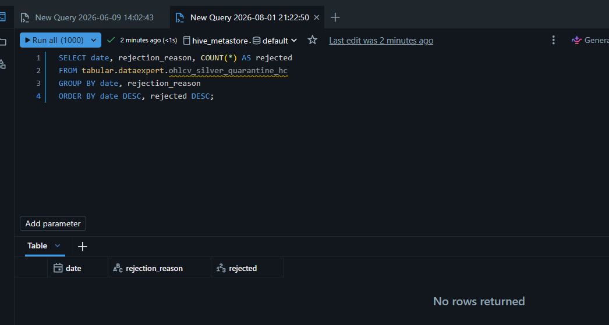

# Querying the Quarantine Tables

How to inspect rejected / invalid records captured by the WAP (Write-Audit-Publish)
pattern. Quarantine exists in **two places**:

- **Silver** — Unity Catalog tables (`ohlcv_silver_quarantine_hc`, `news_silver_quarantine_hc`) plus the `wap_audit_log_hc` quality-rate table.
- **Bronze** — a path-based Delta table for Avro deserialization failures.

**Gold has no quarantine** — OHLC and news validity is enforced upstream at Silver, so
Gold only enforces primary-key columns. It does carry a few **warn-only** expectations
(`@dlt.expect` / `@dlt.expect_all`) where the offending rows are flagged but **kept** in
the table rather than set aside — see [Gold warn-only expectations](#gold-warn-only-expectations)
below for how to find them.

Column definitions for every table below live in
[DATA_DICTIONARY.md](DATA_DICTIONARY.md) (starting at the `ohlcv_silver_quarantine_hc`
section). Lineage is in [DATA_LINEAGE.md](DATA_LINEAGE.md).

---

## Silver quarantine — Unity Catalog tables

These are real UC tables, so query them by fully-qualified name in a Databricks SQL
editor or notebook.

### OHLCV rejected rows

Defined in [ohlcv_silver_dlt.py:455](../databricks/silver/ohlcv_silver_dlt.py#L455).
Partitioned by `date`, with `(symbol, rejection_reason)` as ZORDER columns.

```sql
-- Recent rejected OHLCV rows
SELECT date, rejection_reason, symbol, open, high, low, close, volume, quarantined_at
FROM tabular.dataexpert.ohlcv_silver_quarantine_hc
ORDER BY quarantined_at DESC
LIMIT 100;

-- Rejection breakdown by reason (date prunes partitions, rejection_reason skips files via ZORDER)
SELECT date, rejection_reason, COUNT(*) AS rejected
FROM tabular.dataexpert.ohlcv_silver_quarantine_hc
GROUP BY date, rejection_reason
ORDER BY date DESC, rejected DESC;
```

Valid `rejection_reason` values: `invalid_price_positive`, `invalid_ohlc_logic`,
`invalid_volume`. These are **structural** checks (positive prices, OHLC ordering, a
`volume >= 0` floor) — they do not flag price spikes, stale prints, halts, or
zero-volume bars. The code also has an `unknown` fallback branch
([`ohlcv_quarantine_spark.py:47`](../databricks/utils/ohlcv_quarantine_spark.py#L47)) for
rows that reach quarantine without matching any of the three; it should not appear in
practice — a row only lands in quarantine once at least one rule definitively fails.

> **Example output (2026-08-01):** both queries above returned 0 rows. This is expected
> for a healthy pipeline — it means no ingested OHLCV row has failed a structural check
> since the table was created, not that the query is broken. A non-empty result is the
> signal worth investigating; check `wap_audit_log_hc` (below) first to confirm whether
> the rejection rate is actually non-zero before assuming a query issue.



> **Note:** `COUNT(*)` on this table (deduped — one row per `symbol` + `start_timestamp`
> + `source`) does **not** equal `rejected_count` in `wap_audit_log_hc`, which is a raw
> pre-dedup Bronze count. Use `wap_audit_log_hc` for the rejection *rate*; use this
> table to inspect example rejected rows.

### News rejected rows

Defined in [news_silver_dlt.py:262](../databricks/silver/news_silver_dlt.py#L262).

```sql
SELECT *
FROM tabular.dataexpert.news_silver_quarantine_hc
ORDER BY quarantined_at DESC
LIMIT 100;
```

### Quality audit (rejection rate, not raw rows)

Defined in [ohlcv_silver_dlt.py:525](../databricks/silver/ohlcv_silver_dlt.py#L525).
Check this **first** to answer "did quarantine spike?" — both the numerator
(rejected) and denominator (total) read from pre-dedup Bronze, so Kafka replay does
not skew the rate.

```sql
SELECT audit_date, total_count, rejected_count, rejection_rate_pct,
       quality_gate_passed, quality_gate_warning
FROM tabular.dataexpert.wap_audit_log_hc
ORDER BY audit_date DESC;
```

`quality_gate_passed` is false once the rejection rate crosses the 1% critical
threshold (which halts the pipeline via `expect_or_fail`); `quality_gate_warning`
trips at 0.5%.

---

## Bronze quarantine — path-based Delta (Avro deserialization failures)

This is **not** a catalog table. The Bronze streaming ingestion routes records that
fail Avro deserialization to a Delta table at a Volume path
([streaming_ingestion.py:184](../databricks/bronze/streaming_ingestion.py#L184)), so
query it with the `delta.` path syntax rather than a table name.

```sql
SELECT *
FROM delta.`/Volumes/tabular/dataexpert/hc_market_data/bronze/streaming_quarantine`
ORDER BY 1 DESC
LIMIT 100;
```

Or in PySpark:

```python
spark.read.format("delta") \
    .load("/Volumes/tabular/dataexpert/hc_market_data/bronze/streaming_quarantine") \
    .display()
```

---

## Gold warn-only expectations

Gold has **no quarantine table**, but a few expectations are warn-only: on violation the
row is **flagged and kept** (it is neither dropped nor halted), and the count shows up as a
**Warning** in the DLT pipeline UI. Unlike the Silver quarantine, there is no separate table
to query — the flagged rows are still in the fact table, so you either (a) re-apply the
inverse of the expectation predicate to the table, or (b) read the pass/fail counts from the
DLT event log.

The main example is `no_unexplained_gap` on `fact_daily_market_adjusted_hc`
([dim_split_dlt.py:113-116](../databricks/gold/dim_split_dlt.py#L113-L116)): it warns when a
day-over-day move on `adj_close` is ≥ 40% with no split to explain it — usually a missing
split in `dim_split_hc`. (`dim_ticker_hc` also carries warn-only `@dlt.expect_all` rules —
`valid_exchange`, `has_company_name`, `is_active_known` at
[dim_ticker_dlt.py:58-60](../databricks/gold/dim_ticker_dlt.py#L58-L60) — discoverable via the
same event-log query below by swapping the dataset name.)

### (a) Flagged rows — re-apply the inverse predicate

Because the rows are kept, the warned set is just the negation of the expectation condition:

```sql
-- Rows that tripped no_unexplained_gap: a >=40% adj_close move with no explaining split
SELECT symbol, date, prev_adj_close, adj_close,
       round(adj_close / prev_adj_close - 1, 4) AS pct_move
FROM tabular.dataexpert.fact_daily_market_adjusted_hc
WHERE adj_close      IS NOT NULL
  AND prev_adj_close IS NOT NULL
  AND prev_adj_close > 0
  AND abs(adj_close / prev_adj_close - 1) >= 0.40
ORDER BY abs(adj_close / prev_adj_close - 1) DESC;
```

Most hits are legitimate (penny stocks, tiny `prev_adj_close` denominators). A cluster of the
same `symbol` on one `date` is the tell-tale of a genuinely missing split. This query
re-evaluates against the **current** table state; since the table is a full recompute each
run, the count lines up with the latest run's warning total.

### (b) Pass/fail counts — the DLT event log

The numbers the UI shows (`2 met | 1 unmet`, `4.5K` warnings) come from the pipeline event
log. With Unity Catalog, query it via the `event_log` table-valued function — the `TABLE(...)`
form avoids having to look up the pipeline ID:

```sql
SELECT timestamp, exp.name, exp.dataset, exp.passed_records, exp.failed_records
FROM (
  SELECT timestamp,
         explode(from_json(
           details:flow_progress.data_quality.expectations,
           'array<struct<name:string,dataset:string,passed_records:bigint,failed_records:bigint>>'
         )) AS exp
  FROM event_log(TABLE(tabular.dataexpert.fact_daily_market_adjusted_hc))
  WHERE event_type = 'flow_progress'
)
WHERE exp.failed_records > 0
ORDER BY timestamp DESC;
```

Use **(a)** to investigate *which* symbols/dates are gapping (actionable — points you at a
missing split); use **(b)** for the same failed-record metric the UI shows, e.g. to trend it
across runs.

---

## Quick reference

| Layer  | Table / path                                                                      | Query by      | What it holds                                  |
|--------|-----------------------------------------------------------------------------------|---------------|------------------------------------------------|
| Silver | `tabular.dataexpert.ohlcv_silver_quarantine_hc`                                   | Table name    | Invalid OHLCV rows + `rejection_reason`        |
| Silver | `tabular.dataexpert.news_silver_quarantine_hc`                                    | Table name    | Rejected news articles + reason                |
| Silver | `tabular.dataexpert.wap_audit_log_hc`                                              | Table name    | Daily rejection rate + quality-gate flags      |
| Bronze | `/Volumes/tabular/dataexpert/hc_market_data/bronze/streaming_quarantine`          | `delta.` path | Avro deserialization failures (dead letters)   |
| Gold   | `tabular.dataexpert.fact_daily_market_adjusted_hc` (no quarantine table)           | Inverse predicate / `event_log()` | Warn-only flagged rows kept in place (e.g. `no_unexplained_gap`) |
| Gold   | `tabular.dataexpert.dim_ticker_hc` (no quarantine table)                           | Inverse predicate / `event_log()` | Warn-only flagged rows kept in place (`valid_exchange`, `has_company_name`, `is_active_known`) |
