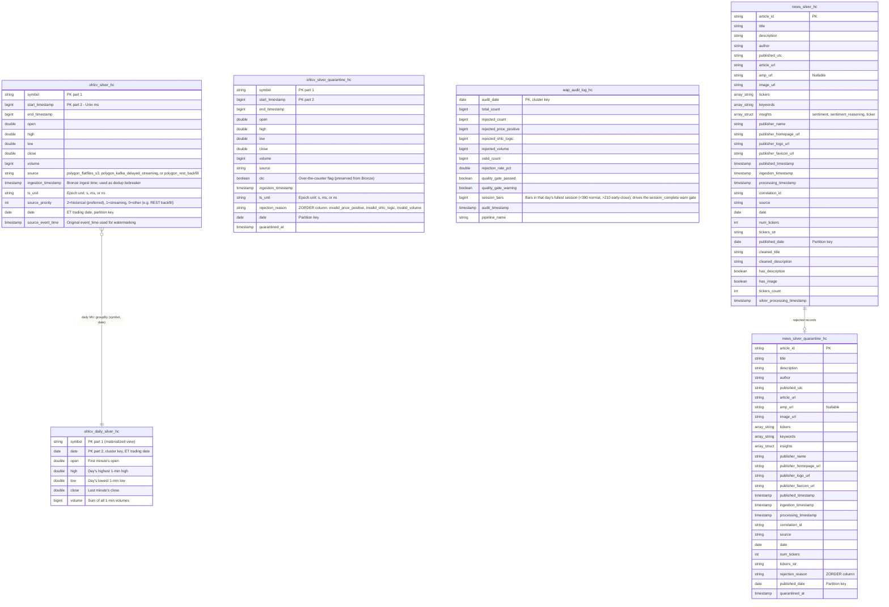

# Silver Layer Entity Relationship Diagram (ERD)

This document contains the conceptual Entity Relationship Diagram for the Silver Layer. The Silver Layer contains cleaned, conformed, and enriched data, along with various derived quality metrics and aggregations.

**Daily OHLCV (`ohlcv_daily_silver_hc`):** materialized view aggregating minute Silver to one row per `(symbol, date)` via a pure `groupBy` (`min`/`max`/`sum`). On serverless the engine refreshes it incrementally — recomputing only changed `(symbol, date)` groups, with full recompute as fallback. DLT runs the minute MERGE before the daily MV refreshes in the same pipeline update (Layer 3 in-pipeline ordering).

