# Screenshots — Pipeline & Dashboard Evidence

Captures of the platform running end-to-end, ordered along the data flow:
Polygon → Kafka → Bronze jobs → Silver/Gold DLT pipelines → WAP quality audit → Streamlit dashboard.
All run on 11 Jun 2026 unless noted.

---

## 1. Ingestion jobs (Polygon → Kafka → Bronze)

### Kafka producer — `polygon_to_kafka_producer`

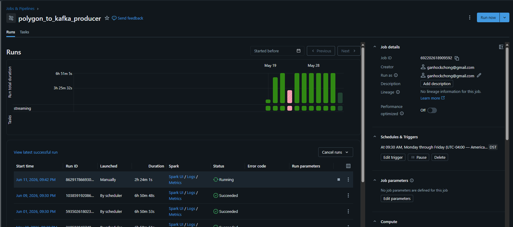

Publishes live 1-minute OHLCV bars from the Polygon WebSocket to Kafka (Avro +
Schema Registry). Scheduled at 9:30 AM Mon–Fri (America/New_York); the
scheduler-launched runs last ~6h 50m — exactly a regular trading session
(9:30 AM–4:00 PM ET) plus the post-close drain window
([streaming_producer.py](../../databricks/bronze/streaming_producer.py)).

### Bronze streaming consumer — `kafka_to_bronze_consumer`

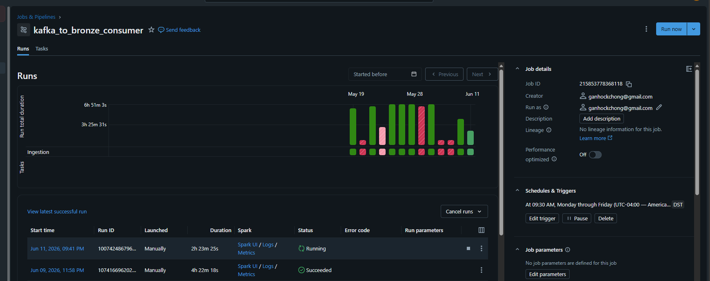

Structured Streaming job that lands Kafka messages in the append-only Bronze
Delta table, on the same 9:30 AM market-hours trigger
([streaming_ingestion.py](../../databricks/bronze/streaming_ingestion.py)).
Captured mid-session with the current run in `Running` state. The red bars in
the run history are manual cancellations from development iterations; anything
left undrained at shutdown is safe — Kafka replays it next session and Silver's
MERGE absorbs the duplicates.

### News ingestion — `news_bronze_daily` and `news_bronze_market_hours`

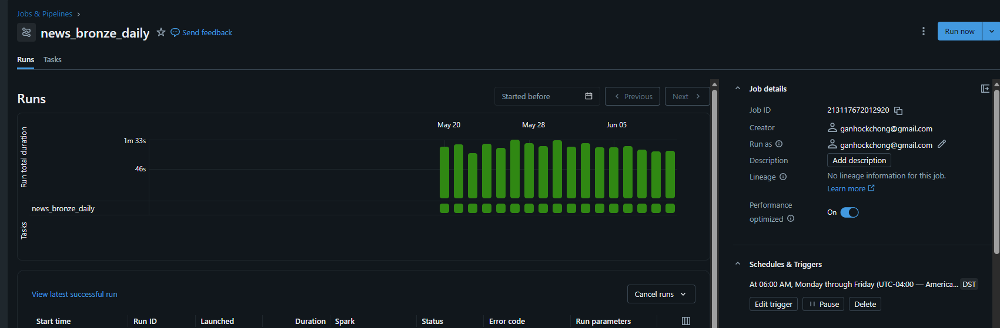

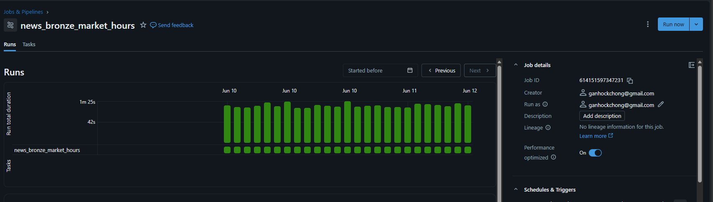

The parallel news pipeline's Bronze jobs: a daily 6:00 AM Mon–Fri catch-up run
(~1m 15s, unbroken green history) and an intraday market-hours variant polling
the Polygon news API throughout the session (all-green runs across Jun 10–12).

---

## 2. DLT pipelines (Bronze → Silver → Gold)

### OHLCV Silver Pipeline

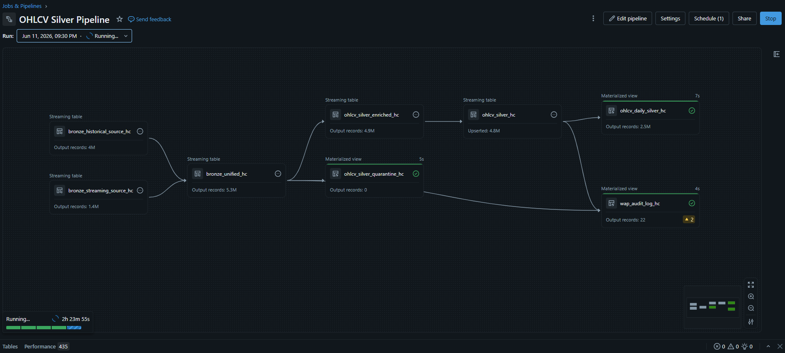

The core Silver DAG ([ohlcv_silver_dlt.py](../../databricks/silver/ohlcv_silver_dlt.py)).
Two independent Bronze sources — historical flat files (4M rows) and the
real-time stream (1.4M rows) — union into `bronze_unified_hc` (5.3M), then:

- `ohlcv_silver_enriched_hc` (4.9M) → `ohlcv_silver_hc` (**4.8M upserted**, not
  appended — the MERGE on `(symbol, start_timestamp)` deduplicates at-least-once
  Kafka delivery and stream/file overlap);
- `ohlcv_silver_quarantine_hc` (0 records — no rule violations this window) and
  `wap_audit_log_hc` (22 daily audit rows) implement the Write-Audit-Publish
  quality pattern;
- `ohlcv_daily_silver_hc` (2.5M) is the incrementally refreshed daily rollup
  that Gold reads instead of scanning minute-grain rows.

### News Silver Pipeline

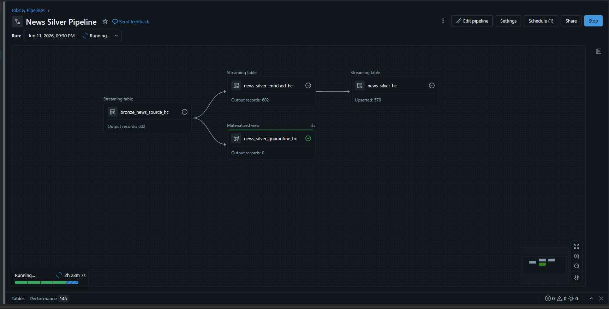

Same WAP shape applied to the news source
([news_silver_dlt.py](../../databricks/silver/news_silver_dlt.py)):
`bronze_news_source_hc` (602) → `news_silver_enriched_hc` (602) →
`news_silver_hc` (570 upserted — duplicate articles merged away), with
`news_silver_quarantine_hc` empty for this run.

### Gold Pipeline

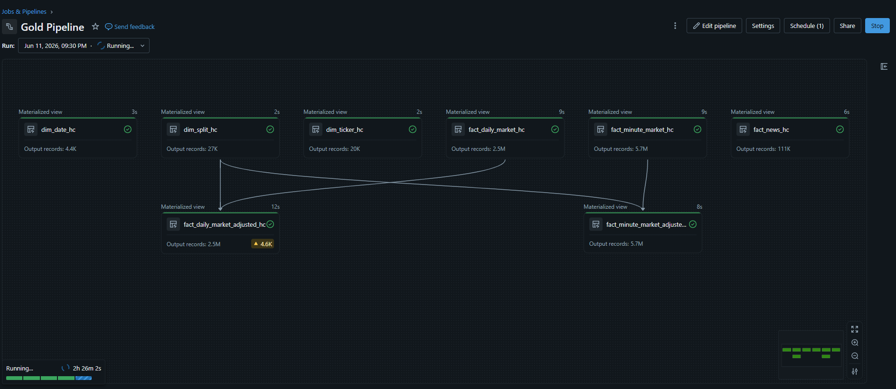

The analytics-ready star schema ([databricks/gold/](../../databricks/gold/)):
dimensions `dim_date_hc` (4.4K), `dim_split_hc` (27K), `dim_ticker_hc` (20K)
beside facts `fact_daily_market_hc` (2.5M), `fact_minute_market_hc` (5.7M),
and `fact_news_hc` (111K). The split dimension feeds the two split-adjusted
fact tables downstream (`fact_daily_market_adjusted_hc`,
`fact_minute_market_adjusted_hc`), so a 10:1 split day doesn't read as a −90%
return.

---

## 3. WAP quality audit table

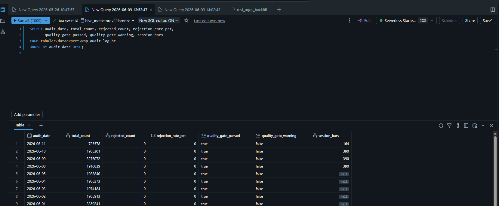

One row per trading day — the day's quality scorecard from `tabular.dataexpert.wap_audit_log_hc`
(defined in [ohlcv_silver_dlt.py](../../databricks/silver/ohlcv_silver_dlt.py)).
Gaps in `audit_date` (e.g. May 23–25, May 30–31) are weekends and market holidays.

**Why `session_bars` is null for older dates — by design, not missing data.**
The table mixes two lookback windows:

- `total_count`, `rejected_count`, and `rejection_rate_pct` are computed over a rolling
  **30-day** Bronze window, so every row has them.
- `session_bars` is computed over only the last **3 days** of Silver, because the
  `session_complete` warning it feeds only evaluates the most recent 2 days — anything
  older is exempt committed history. Scanning 30 days of minute-grain Silver to fill a
  column nobody acts on would be the most expensive part of the audit, so it is
  deliberately skipped and the expectation treats `NULL` as exempt
  (`session_bars IS NULL OR ...`).

Reading the values: **390** = a full regular session of 1-minute bars
(9:30 AM–4:00 PM ET = 390 minutes), so those days were complete. A lower number on the
most recent date (e.g. 164) means the audit row was computed mid-session while the
market was still open — it converges to 390 on the next run, since `session_bars` is
the fullest single symbol's bar count for that day.

The two gate columns enforce the quality SLA: `quality_gate_warning` trips at a 0.5%
rejection rate, and `quality_gate_passed = false` past the 1% critical threshold halts
the pipeline via `expect_or_fail` (with a 2-day grace window so late-arriving history
cannot retroactively fail a run).

---

## 4. Streamlit dashboard

### Signal Screener

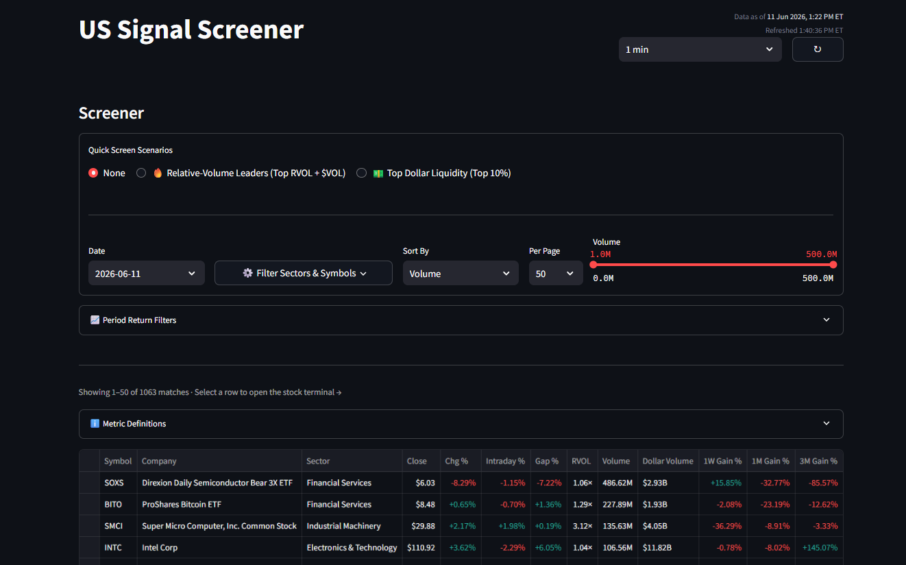

Scans 1,063 matching tickers for the selected trading day with quick-screen
scenarios (relative-volume leaders, top dollar liquidity), sector/symbol
filters, a volume range slider, and period-return filters. Each row links into
the stock terminal.

### Stock Deep Dive

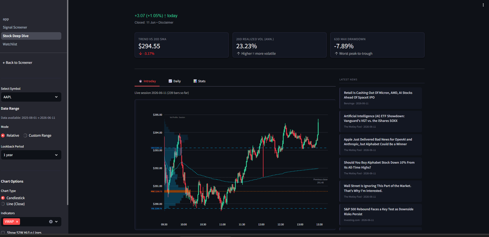

Per-ticker terminal (AAPL shown, live session with 239 bars so far): summary
metrics (trend vs. 20-day SMA, 20-day realized volatility, 63-day max
drawdown), an intraday candlestick chart with session volume profile and VWAP
indicator, configurable lookback, and the ticker's latest news from
`fact_news_hc`.

### Watchlist

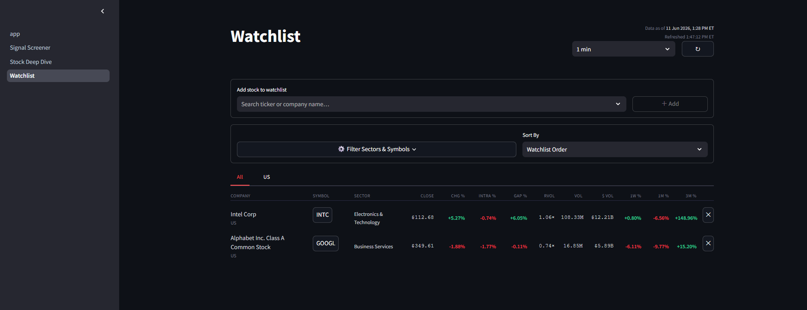

Persistent user watchlist with add-by-ticker search, sector filters, custom
sort, and per-row intraday/1-week/1-month/3-month performance pulled from the
Gold fact tables.
